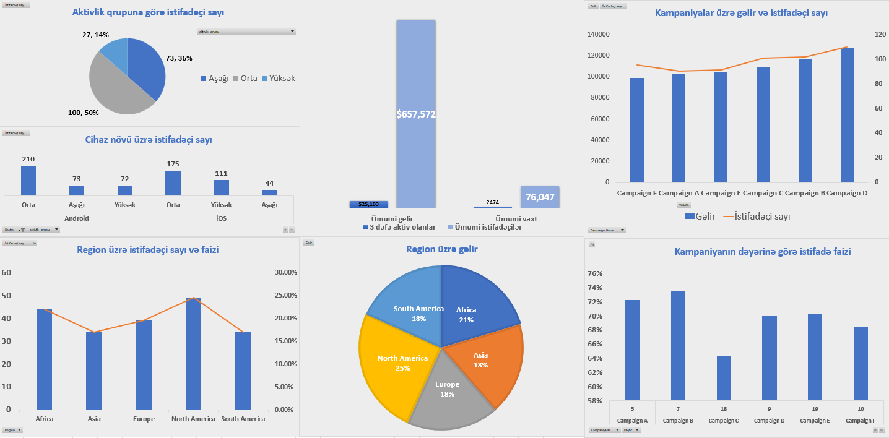

# Mobil Tətbiq İstifadəçi Analizi (Excel)

## Layihənin Məqsədi
Bu layihənin məqsədi mobil tətbiq istifadəçilərinin davranışlarını təhlil etmək və əsas performans göstəricilərini (KPI) Excel vasitəsilə analiz etməkdir.

## İstifadə olunan Alətlər
- Microsoft Excel
- Pivot Cədvəllər
- Power Query
- Power Pivot
- Charts
- Excel formulları 

## Aparılan Təhlillər
- Günlük və Aylıq Aktiv İstifadəçilər 
- Cihaz növü üzrə analiz
- Loyal istifadəçilər ilə digər istifadəçilərin müqayisəsi
- Region üzrə analiz
- Gəliri az amma istifadəçi sayı çox olan kampaniyalar
- Qiyməti çox olan amma az ödəniş edilən kampaniyanı müəyyənləşdirmək

## Region və Kampaniya Analizi Dashboard-u

## Fayllar
Mobile App.xlsx – əsas analiz faylı

